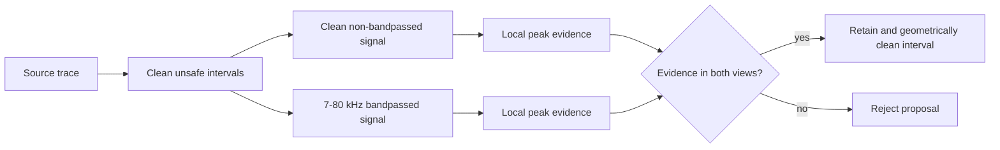

# Dual-Clean C1 Detection Dataset Card

**Registered ID:** `particles2snr-f-dual-clean-c1-yolo-4class@v1`

**Status:** active; final source dataset for the P1/P2/MOMENT detection study

**Owner:** `particles2SNR-pipeline`

**Format:** YOLO-style one-dimensional intervals with NumPy signals

**Registry manifest SHA-256:**
`6264e132ae77ba3eaba8021826e0c524dd008ae331123e5bd2006c611c905345`

This card describes the registered particle-source dataset. Detector caches may
add explicit noise traces or deterministic training augmentation; those derived
populations are documented separately and must not be mistaken for source rows.

## 1. Intended Task

Each example is a 16,384-sample OFI trace sampled at 2 MHz. A detector predicts
zero or more temporal intervals and one of three known particle sizes. A fourth
label, `unclear`, preserves weak event localization without asserting a physical
particle class.

```text
signal -> [(class_id, center, width), ...]
```

`center` and `width` are normalized by signal length. Empty label files are
valid background examples, not missing annotations.

## 2. Source Dataset Composition

| Split | Signal rows | Empty-label rows | Event-bearing rows | Event labels |
|---|---:|---:|---:|---:|
| Train | 1,848 | 1,163 | 685 | 1,332 |
| Validation | 462 | 290 | 172 | 348 |
| Test | 578 | 370 | 208 | 401 |
| **Total** | **2,888** | **1,823** | **1,065** | **2,081** |

The event-label distribution is:

| Split | 2 um | 4 um | 10 um | `unclear` |
|---|---:|---:|---:|---:|
| Train | 150 | 973 | 149 | 60 |
| Validation | 49 | 248 | 42 | 9 |
| Test | 60 | 279 | 44 | 18 |

The dataset is strongly imbalanced toward 4 um events. Results must therefore
include per-class behavior or known-class mAP; aggregate event detection alone
cannot establish physical-class performance.

## 3. How Labels Were Produced

The source class folders contain 2 um, 4 um, and 10 um traces. The
`particles2SNR` signal-processing detector proposes events, after which the
generation pipeline applies:

1. saturation and unsafe-interval replacement using recorded noise;
2. a fourth-order 7-80 kHz Butterworth bandpass;
3. a passage-time filter of 0.07-0.65 ms;
4. a YOLO interval-width filter of 0.08-1.50 ms;
5. dual-clean peak-evidence filtering;
6. conditional temporal NMS at IoU 0.40, with duplicate and close-event rules;
7. midpoint resolution of overlapping adjacent interval boundaries.

The source `.npy` files are not modified. Cleaning and annotations are derived
outputs. The detailed generation history and parameters are retained in
[`P0_C1_Particles2SNR_F_PIPELINE.md`](P0_C1_Particles2SNR_F_PIPELINE.md).

### What "dual-clean" means

An event requires compatible local peak evidence in both:

- the cleaned, bandpassed signal; and
- the cleaned, non-bandpassed signal.

This rejects detections supported only by a peak introduced or emphasized by
the 7-80 kHz filter. It is a label-quality rule, not a second model input.



## 4. Ambiguous Labels

The physical source class is replaced by `unclear` when the post-processed
event has `snr_db < -10 dB`:

```text
0: 2um
1: 4um
2: 10um
3: unclear
```

P1 stores `unclear` as a fourth YOLO class. P2 maps it to an ignored known-class
target while retaining its localization and event-presence target. Consequently,
known-class mAP excludes `unclear`, whereas class-agnostic event metrics include
it. Papers must state this distinction explicitly.

## 5. Background Populations in the Comparison

Three related counts answer different questions:

| Population | Count | Meaning |
|---|---:|---|
| Source test empty-label rows | 370 | Background windows owned by this registered dataset |
| Canonical detector-cache backgrounds | 425 | The 370 source rows plus 55 explicit recorded-noise test rows |
| Content-disjoint P2 sensitivity | 402 | One row per content hash after removing test content seen in train/validation and a within-test duplicate |

Only the first population is part of this source dataset. The 425- and 402-row
populations are derived evaluation contracts. Their construction and identity
audit are documented in the
[`P2 Complete Study Report`](../segmentation-at-any-hardware-cost/docs/P2_COMPLETE_STUDY_REPORT.md#background-data)
and the
[`P2 background identity audit`](../artifacts/SMI_Detection_CNN_transformers/research/p2_representation_background_identity_audit_20260713/run.json).

The historical 305-row "external" background manifest is not external: it is
the detector cache's 206/44/55 train/validation/test noise pool. It must not be
used as independent evidence.

## 6. Provenance and Integrity

Resolve the dataset through its registered ID rather than a hard-coded path:

```bash
.venv/bin/workspace datasets resolve particles2snr-f-dual-clean-c1-yolo-4class --version v1
```

The registry entry records 5,779 files: 2,888 signals, 2,888 label files, the
dataset metadata file, and their content manifest. A cross-project semantic
audit matched all 2,888 unaugmented P1/P2 source signals and labels. The P2
content audit additionally found that all cross-split exact duplicates were
explicit noise traces, not particle traces.

Primary evidence:

- registry entry: [`datasets/registry/index.yaml`](../datasets/registry/index.yaml);
- content manifest:
  [`particles2snr-f-dual-clean-c1-yolo-4class-v1.jsonl`](../datasets/registry/particles2snr-f-dual-clean-c1-yolo-4class-v1.jsonl);
- P1/P2 semantic audit:
  [`P1_P2_LABEL_PROVENANCE_AUDIT.md`](../artifacts/cross-project/reports/p1_p2_label_provenance_audit_20260710_corrected/P1_P2_LABEL_PROVENANCE_AUDIT.md).

## 7. Appropriate and Inappropriate Uses

Appropriate uses:

- supervised 1D event detection and localization;
- comparison of models under the same split and label contract;
- known-class and class-agnostic event evaluation;
- background-FPR calibration when the derived background population is stated.

Do not use this dataset alone to claim:

- generalization to a new acquisition campaign or instrument;
- an independent external-background result;
- causal superiority of CNNs or transformers without matched heads, budgets,
  optimization, and pretraining;
- reliable estimates for minority classes without uncertainty and per-class
  reporting.

## 8. Study Links

- P1 specialist report:
  [`P1_COMPLETE_STUDY_REPORT.md`](../SMI_Detection_CNN_transformers/docs/P1_COMPLETE_STUDY_REPORT.md)
- P2 specialist report:
  [`P2_COMPLETE_STUDY_REPORT.md`](../segmentation-at-any-hardware-cost/docs/P2_COMPLETE_STUDY_REPORT.md)
- integrated P1/P2/MOMENT manuscript:
  [`PARTICLE_DETECTION_PIPELINE_COMPARISON.md`](../docs/manuscript/PARTICLE_DETECTION_PIPELINE_COMPARISON.md)
- pedagogical architecture guide:
  [`detection-classification-architectures.md`](../docs/architecture/detection-classification-architectures.md)
